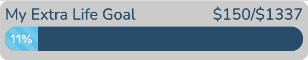
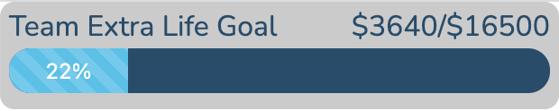
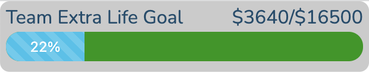
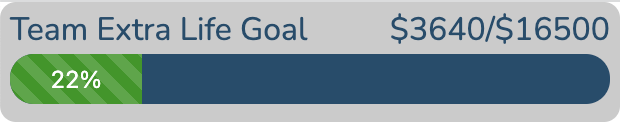
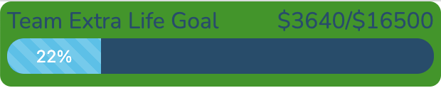
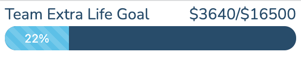
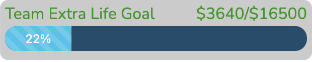
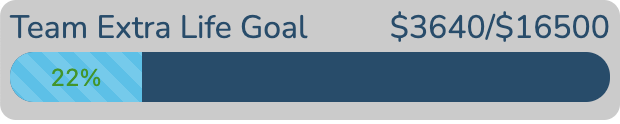

# Extra Life Progress Bar
A simple progress bar to track your extra life donation progress on stream.

To track the progress of an individual participant, set the participantID parameter to their participant id. This can be found at the end of the URL on their Extra Life page.  
**EX:** https://behnke19.github.io/extra-life-progress/tracker.html?participantID=449385

To track the progress of a team, set the teamID parameter to the team's id. This can be found at the end of the URL on the team's Extra Life Page.  
**EX:** https://behnke19.github.io/extra-life-progress/tracker.html?teamID=55806  

The bar will update every 60 seconds.

## Customizing The style
The appearance of the progress tracker can be customized using additional url parameters. The only difference between the team and individual trackers is the label. The parameters you can use to customize the look are detailed below. In each example the color will be set to a dark green so it is easy to see what changed.
**NOTE** For all the color ones a hex color code should be provided without the '#' on the front.
### Default Individual Goal Style

### Default Team Goal Style

### Change Progress Bar Background Color
Add a url parameter called progressBackgroundColor and set it to a hex color code.  
**EX:** https://behnke19.github.io/extra-life-progress/tracker.html?teamID=55806&progressBackgroundColor=019805  

### Change Progress Color
Add a url parameter called progressColor and set it to a hex color code.  
**EX:** https://behnke19.github.io/extra-life-progress/tracker.html?teamID=55806&progressColor=019805  

### Change Background color
Add a url parameter called backgroundColor and set it to a hex color code.  
**EX:** https://behnke19.github.io/extra-life-progress/tracker.html?teamID=55806&backgroundColor=019805  

### Transparent Background
Add a url parameter called noBackground and set it to true.  
**EX:** https://behnke19.github.io/extra-life-progress/tracker.html?teamID=55806&noBackground=true  

### Change Label Text color
Add a url parameter called labelColor and set it to a hex color code.  
**EX:** https://behnke19.github.io/extra-life-progress/tracker.html?teamID=55806&labelColor=019805  

### Change Progress Text color
Add a url parameter called percentTextColor and set it to a hex color code.  
**EX:** https://behnke19.github.io/extra-life-progress/tracker.html?teamID=55806&percentTextColor=019805  

## Using The Progress Bar On Stream
Simply add a browser source with your custom URL to your stream tool of choice (I use OBS) and set the width to 310px and height to 60px.  
